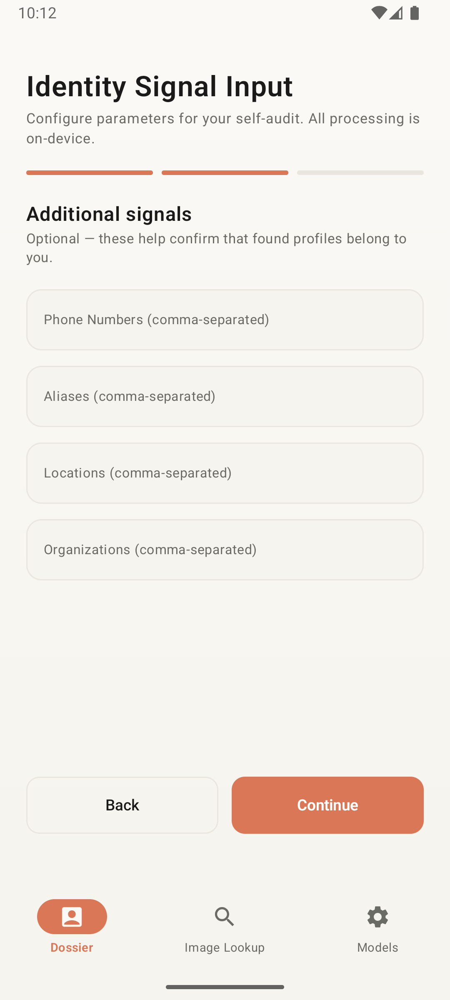
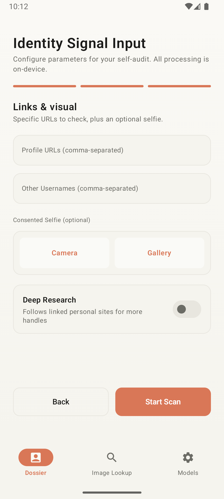

# Dossier

<p align="center">
  <strong>Private exposure intelligence for your own digital footprint.</strong>
</p>

<p align="center">
  Dossier is a consent-first Android app for auditing public profile exposure, discovering reused handles, reviewing exposed personal signals, and generating a local privacy report.
</p>

<p align="center">
  
  
  
  
</p>

<p align="center">
  
  
  
</p>

## Brand Promise

Dossier turns a privacy self-audit into a calm intelligence brief. The app is built around three rules:

- Consent first: audit only yourself or a target that explicitly consented.
- Local by default: app state, report generation, and image analysis orchestration stay on device.
- Evidence over drama: findings are best-effort public signals, never proof of identity or ownership.

## What It Does

- Guides a user through a self-audit consent and identity signal flow.
- Generates username variants from supplied names and handles.
- Checks public profile pages across common platforms.
- Verifies profiles with public HTTP checks and rendered WebView fallback.
- Discovers one-hop self-disclosed profile links and handles.
- Offers optional Deep Research for linked personal websites.
- Extracts exposed emails, phone numbers, locations, organizations, usernames, profiles, and sensitive snippets.
- Scores exposure risk and generates remediation guidance.
- Produces a shareable plain-text dossier report.
- Estimates where an image was taken using EXIF GPS, on-device OCR, scene labels, and public-web search of extracted clues.
- Applies a face safety gate during image lookup: face detection disables identity search while location analysis can continue.

## Screenshots

<table>
  <tr>
    <td align="center"><br><sub>Consent</sub></td>
    <td align="center"><br><sub>Identity Input</sub></td>
    <td align="center"><br><sub>Additional Signals</sub></td>
  </tr>
  <tr>
    <td align="center"><br><sub>Links &amp; Visual</sub></td>
    <td align="center"><br><sub>Username Discovery</sub></td>
    <td align="center"><br><sub>Scan Progress</sub></td>
  </tr>
  <tr>
    <td align="center"><br><sub>Dossier Report</sub></td>
    <td align="center"><br><sub>Image Lookup</sub></td>
    <td align="center"><br><sub>Models</sub></td>
  </tr>
</table>

The generated screenshot bundle is available at `screenshots/dossier-emulator-screenshots.zip`.

## Privacy And Safety Model

Dossier is designed for self-consented audits.

- There is no telemetry or project-hosted backend in this app.
- Identity scan data is held in local session state and can be purged from the app flow.
- Public profile scans and web evidence lookup make normal network requests to public websites.
- Image bytes stay on device during reverse image lookup.
- If image GPS is absent, only extracted text and scene-label clues are searched on the public web.
- Face detection is used as a safety gate, not as public facial identification.
- Results are best-effort signals and should be reviewed by a human.

## Tech Stack

- Kotlin 2.1.0
- Android Gradle Plugin 8.7.3
- Gradle wrapper 9.5.1
- Jetpack Compose with Material 3
- Navigation Compose
- Kotlinx Serialization
- OkHttp and Jsoup
- Android WebView
- ML Kit face detection, text recognition, and image labeling
- MediaPipe Tasks dependencies for future local AI work
- Lottie Compose
- JUnit unit tests

## Requirements

- Android Studio with Android SDK 35 installed.
- JDK 21.
- Android device or emulator running Android 8.0+ (API 26+).

Android Studio usually creates `local.properties` automatically with your local SDK path. Do not commit that file.

## Build Locally

Build a debug APK:

```sh
./gradlew :app:assembleDebug
```

Debug APK output:

```text
app/build/outputs/apk/debug/app-debug.apk
```

Install the debug build on a connected device or emulator:

```sh
./gradlew :app:installDebug
```

Build an unsigned release APK:

```sh
./gradlew :app:assembleRelease
```

Unsigned release APK output:

```text
app/build/outputs/apk/release/app-release-unsigned.apk
```

Run unit tests:

```sh
./gradlew :app:testDebugUnitTest
```

Clean generated outputs:

```sh
./gradlew clean
```

## GitHub Release APK

The workflow at `.github/workflows/build-release-apk.yml` builds Dossier `0.1.0`.

To publish the APK to GitHub Releases, push the release tag:

```sh
git tag v0.1.0
git push origin v0.1.0
```

You can also run the workflow manually from GitHub Actions. The workflow uploads a debug APK artifact for quick testing, but GitHub Releases require a signed release APK. Unsigned release APKs are not installable on Android.

Create a release keystore locally:

```sh
keytool -genkeypair \
  -v \
  -keystore dossier-release.jks \
  -alias dossier \
  -keyalg RSA \
  -keysize 2048 \
  -validity 10000
```

Convert the keystore to a one-line base64 value for GitHub Secrets:

```sh
base64 < dossier-release.jks | tr -d '\n'
```

Add these repository secrets:

- `ANDROID_KEYSTORE_BASE64`
- `ANDROID_KEYSTORE_PASSWORD`
- `ANDROID_KEY_ALIAS`
- `ANDROID_KEY_PASSWORD`

Use the keystore password you entered for `ANDROID_KEYSTORE_PASSWORD`, the alias `dossier` for `ANDROID_KEY_ALIAS`, and the key password you entered for `ANDROID_KEY_PASSWORD`.

## Project Structure

```text
app/src/main/java/io/dossier/app/
  data/          Platform registries, local cache, web and vision adapters
  domain/        Models, scanners, AI engine abstractions, risk and remediation logic
  export/        Report export/share logic
  ui/            Compose screens, navigation, theme, and reusable components

app/src/main/assets/
  compute.json
  investigate.json
  search.json
  web.json

app/src/test/java/io/dossier/app/
  Unit tests for extraction, risk scoring, username generation, web search, and profile belonging rules
```

## Main User Flow

1. Accept the consent screen.
2. Enter identity signals: name, primary username, email, optional aliases, phones, locations, organizations, profile URLs, and other usernames.
3. Review generated username variants and add custom handles.
4. Run the exposure scan.
5. Review the dossier report, exposure logs, risk level, and remediation tips.
6. Share the generated plain-text report if needed.

The bottom navigation also exposes:

- Image Lookup: estimate where an image was taken from local metadata and extracted clues.
- Models: inspect available on-device AI engines.

## Permissions

The app declares:

- `INTERNET` for public profile checks and web evidence lookup.
- `CAMERA` for capturing consented images.
- `READ_MEDIA_IMAGES` on newer Android versions.
- `READ_EXTERNAL_STORAGE` for Android 12 and below.

## Limitations

- Public sites may block, rate-limit, challenge, or hide profiles from automated checks.
- Some platforms require login or render incomplete public pages.
- Name-only scans are lower confidence than scans with explicit usernames or profile URLs.
- Face consistency matching is intentionally skipped unless real profile image scraping and a real embedding model are added.
- Optional LLM-style engines are not silently mocked; unavailable or gated engines remain unavailable in this build.

## License

Apache License 2.0. See [LICENSE](LICENSE).
