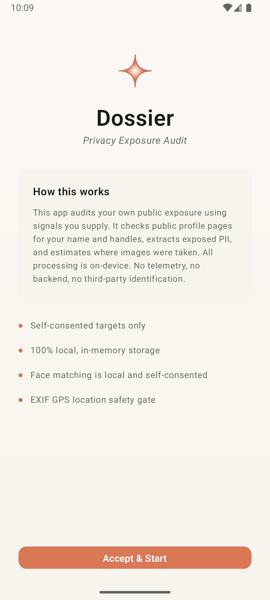
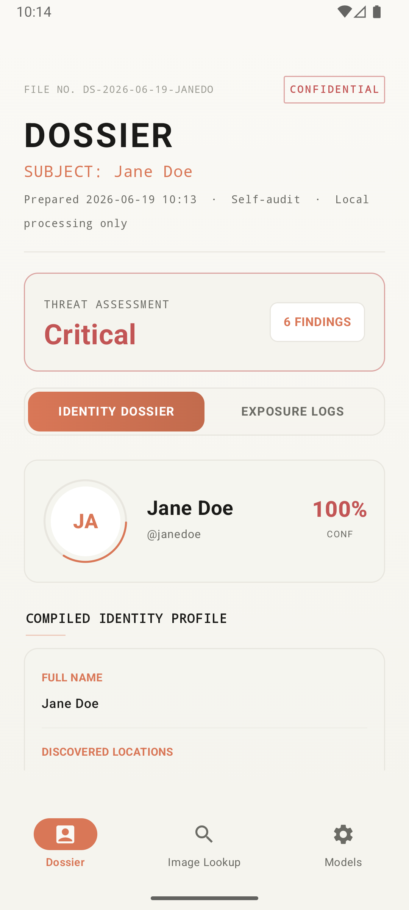
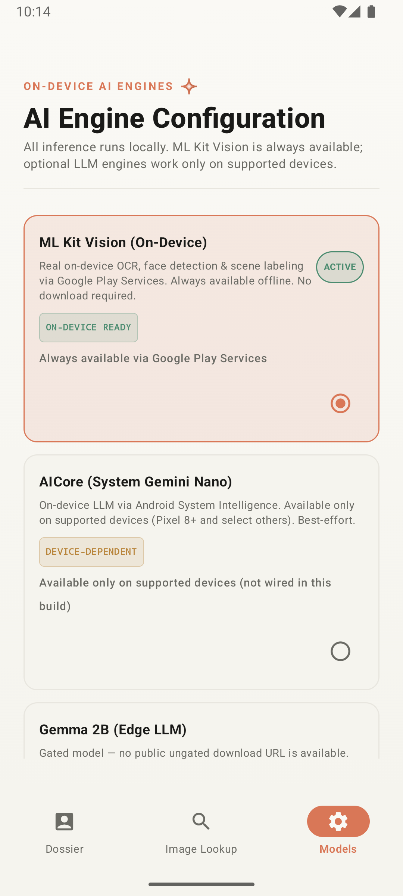
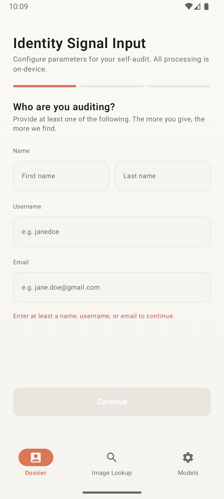
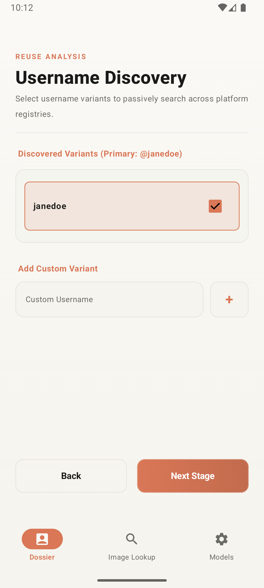
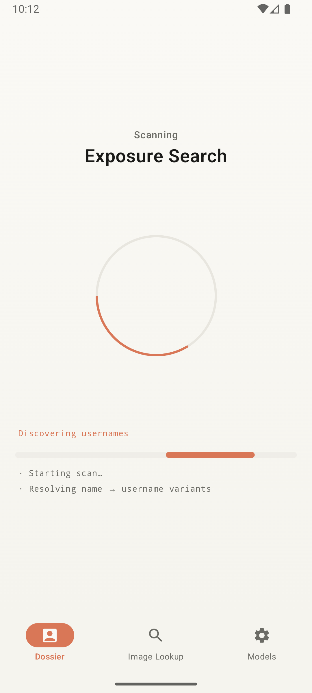
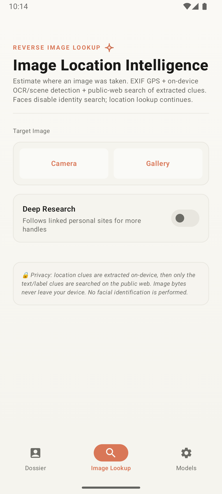

# Dossier

Consent-first Android privacy exposure auditing for your own public digital footprint.

<p align="center">
  
  
  
  
</p>

<p align="center">
  
  
  
</p>

## What Dossier Is

Dossier is a self-audit tool. You provide identity signals that you own or are explicitly authorized to audit, and the app looks for public exposure evidence across profile pages, search indexes, image indexes, breach metadata, and local media clues.

The app is intentionally evidence-oriented. A result can be verified, plausible, or review-only; it should not be treated as proof of identity or account ownership without manual confirmation.

## Current Capabilities

- Consent and identity-signal intake for name, usernames, aliases, emails, phones, locations, organizations, explicit profile URLs, and an optional selfie.
- Username variant generation and user-controlled variant selection.
- Public profile checks across common platforms such as GitHub, X, Reddit, LinkedIn, Instagram, YouTube, TikTok, Twitch, GitLab, Medium, Dev.to, Bluesky, Mastodon, Pinterest, Telegram, and Hacker News.
- Rendered WebView fallback for pages that need JavaScript before profile verification.
- One-hop pivot discovery from links and handles self-disclosed on confirmed profiles.
- Optional Deep Research that follows a small number of linked personal websites and fetches extra public evidence.
- Public-search discovery through DuckDuckGo, Bing, Google, and Yandex result pages.
- Public image-index discovery through Bing Images and DuckDuckGo image search using identity terms only.
- PII extraction for exposed emails, phones, names, aliases, locations, organizations, and sensitive snippets.
- Risk scoring, remediation guidance, and a shareable plain-text report.
- Breach checks:
  - Passwords use Have I Been Pwned Pwned Passwords k-anonymity range checks.
  - Emails can use HIBP breached-account metadata when the user supplies a HIBP API key.
  - Emails also run bounded public-search evidence checks.
- Reverse media lookup:
  - Images: EXIF GPS, on-device OCR, scene labels, face safety gate, and web search over extracted text/label clues.
  - Videos: samples a few local frames, extracts OCR/labels locally, flags faces as a safety gate, and searches only extracted clues.
- AI summary generation:
  - Local Gemma E2B/E4B MediaPipe LLM model files can be downloaded/imported.
  - Optional remote providers include OpenAI-compatible APIs, Anthropic, Ollama, Hugging Face Inference, and OpenRouter.
  - Remote provider model discovery is available where the provider exposes a model-list endpoint.

## Privacy And Network Behavior

Dossier has no project-hosted backend and no app telemetry, but it is not fully offline.

The following operations make network requests:

- Public profile checks and rendered-page verification.
- Search-index and image-index discovery.
- Reverse image/video location lookup when EXIF GPS is absent and text/label clues are searched.
- HIBP password range checks, which send only the first five SHA-1 hash characters.
- HIBP email breach checks when a HIBP API key is supplied.
- Optional remote AI summaries and model-list refreshes.
- Local model downloads from Hugging Face LiteRT Community URLs.

The following data stays local in the current design:

- Selfie and selected image/video bytes are not uploaded by the reverse media lookup pipeline.
- Video lookup samples frames locally and searches only OCR/label text.
- Face *detection* is a safety gate for reverse media lookup (no public facial identification of strangers).
- Face *consistency* scoring against discovered profile avatars is optional and on-device only when you import a face embedding model (and calibration for evidence thresholds). Avatar downloads are bounded; selfie bytes are not uploaded for matching.
- Password plaintext is cleared from the breach screen after checks and is not included in results.

API keys for remote AI providers are encrypted with Android Keystore-backed AES-GCM before persistence. HIBP API keys are entered per lookup and are not persisted.

## Screenshots

<table>
  <tr>
    <td align="center"><br><sub>Consent</sub></td>
    <td align="center"><br><sub>Identity Input</sub></td>
    <td align="center"><br><sub>Username Discovery</sub></td>
  </tr>
  <tr>
    <td align="center"><br><sub>Scan Progress</sub></td>
    <td align="center"><br><sub>Dossier Report</sub></td>
    <td align="center"><br><sub>Media Lookup</sub></td>
  </tr>
  <tr>
    <td align="center"><br><sub>Models</sub></td>
  </tr>
</table>

## Main User Flow

1. Accept the consent screen.
2. Enter identity signals.
3. Review generated username variants and add custom handles.
4. Run the exposure scan.
5. Review verified profiles, public-search review candidates, image evidence, extracted PII, risk level, AI/baseline summary, and remediation actions.
6. Open evidence in the built-in browser or share the plain-text report.

The bottom navigation also exposes:

- Media Lookup: reverse image/video location estimation from local metadata and extracted clues.
- Breach: HIBP password range checks, optional HIBP email breach metadata, and public email evidence search.
- Models: local model management and remote provider configuration.

## AI Provider Configuration

The Models screen supports both local and remote engines.

Local engines:

- ML Kit Vision is always available for OCR, face detection, and scene labeling.
- AICore uses ML Kit GenAI Prompt API with Gemini Nano on supported devices. The Models screen checks the official feature status (`AVAILABLE`, `DOWNLOADABLE`, `DOWNLOADING`, `UNAVAILABLE`) and exposes a user-triggered download action when Gemini Nano is downloadable.
- Gemma E2B and Gemma E4B use public Hugging Face LiteRT Community `.task` downloads or user-imported MediaPipe task files.
- MediaPipe vision labels are import-only: ImageClassifier first, ObjectDetector fallback. Free-form multimodal scene text uses AICore (Gemini Nano), not this path.

Face embedding models:

- **Bundled by default:** a FaceNet TFLite model ships in `app/src/main/assets/models/facenet.tflite` (~23 MB) with factory calibration (`facenet-calibration.json`). No import required for demos.
- Provide a selfie during identity intake. During scan, Dossier downloads discovered profile avatars (bounded) and scores them on-device against the selfie.
- Optional: replace with your own ONNX/TFLite model or evaluation calibration JSON on the Models screen (SHA-256 must match the active model).

```json
{
  "reviewThreshold": 0.42,
  "samePersonThreshold": 0.71,
  "modelSha256": "aaaaaaaaaaaaaaaaaaaaaaaaaaaaaaaaaaaaaaaaaaaaaaaaaaaaaaaaaaaaaaaa",
  "positivePairCount": 200,
  "negativePairCount": 1000,
  "reviewFalseAcceptRate": 0.02,
  "samePersonFalseAcceptRate": 0.001,
  "reviewTrueAcceptRate": 0.98,
  "samePersonTrueAcceptRate": 0.91,
  "source": "arcface-lfw-eval"
}
```

Remote providers:

- OpenAI/OpenAI-compatible: `{baseUrl}/chat/completions`, model list from `{baseUrl}/models`.
- Anthropic: `{baseUrl}/messages`, model list from `{baseUrl}/models`.
- Ollama: `{baseUrl}/api/chat`, model list from `{baseUrl}/api/tags`.
- Hugging Face: `{baseUrl}/models/{model}`, curated presets only.
- OpenRouter: OpenAI-compatible chat completions and model list from `/api/v1/models`.

If multiple remote providers are enabled, the Models screen priority order is used (first usable enabled provider with a key when required).

## Build Locally

Requirements:

- Android Studio with Android SDK 35.
- JDK 21.
- Android device or emulator running Android 8.0+ (API 26+).

Android Studio normally creates `local.properties` with your SDK path. Do not commit it.

Run unit tests:

```sh
./gradlew :app:testDebugUnitTest
```

Build a debug APK:

```sh
./gradlew :app:assembleDebug
```

Install on a connected emulator/device:

```sh
./gradlew :app:installDebug
```

Build a release APK. Without private signing properties this produces an unsigned artifact; with `RELEASE_*` Gradle properties it produces a signed artifact.

```sh
./gradlew :app:assembleRelease
```

Clean generated outputs:

```sh
./gradlew clean
```

## Permissions

The app declares:

- `INTERNET` for public pages, search evidence, HIBP checks, model discovery, model downloads, and optional remote AI.
- `CAMERA` for optional consented image capture.
- `READ_MEDIA_IMAGES` for selected images on newer Android versions.
- `READ_MEDIA_VIDEO` for selected videos on newer Android versions.
- `READ_EXTERNAL_STORAGE` for Android 12 and below.

## Project Structure

```text
app/src/main/java/io/dossier/app/
  data/
    ai/        Remote/local AI adapters, provider config, model discovery
    breach/    HIBP password/email checks
    place/     EXIF, face, OCR, image labeling adapters
    platform/  Platform profile registry
    web/       Search, image search, web location, link-following helpers
  domain/
    ai/        Local model types and downloader
    breach/    Breach result models
    face/      Local face model import, calibration JSON sidecar, and ONNX/TFLite similarity scoring
    model/     Shared app models
    pii/       PII extraction
    place/     Reverse image/video orchestration
    risk/      Risk scoring
    scanner/   Profile scan session, scanner, WebView rendering, handle pivots
    username/  Username variant generation
  export/      Plain-text and JSON report helpers
  ui/          Compose screens, navigation, components, theme

app/src/test/java/io/dossier/app/
  Unit tests for model discovery, search parsing, image search parsing, breach parsing,
  scanner attribution, PII extraction, username variants, risk scoring, and video sampling.
```

## Status And Roadmap

- **[STATUS.md](STATUS.md)** — what works today, verification, demo checklist, known limits  
- **[ENHANCEMENTS.md](ENHANCEMENTS.md)** — prioritized next improvements (P0–P6)

## Known Limitations

- **Not fully on-device.** Profile checks, search/image indexes, breach public search, model downloads, and optional remote AI use the network.
- Public sites can block, rate-limit, challenge, or change markup at any time; many SPA social profiles stay *Unverifiable*.
- Search and image-index hits are review candidates, not verified ownership.
- Face consistency uses the bundled FaceNet model (+ factory thresholds). Treat scores as supporting evidence; replace calibration with a real evaluation set for research rigor.
- HIBP email breach *catalog* needs an API key (Breach tab); scan fusion still runs public-index email evidence without a key.
- Reverse media location is an estimate from EXIF/OCR/labels + text search.
- Session state is in-memory; purge clears the case.
- Release signing needs private `RELEASE_*` / CI keystore secrets for distribution builds.

## Verification

```sh
JAVA_HOME=/Library/Java/JavaVirtualMachines/zulu-21.jdk/Contents/Home ./gradlew :app:testDebugUnitTest :app:assembleDebug :app:assembleRelease --quiet
```

Passed under JDK 21 after the multi-source fusion work. Prefer JDK 21 (Android lint is unreliable on JDK 25 in this environment).

## License

Apache License 2.0. See [LICENSE](LICENSE).
