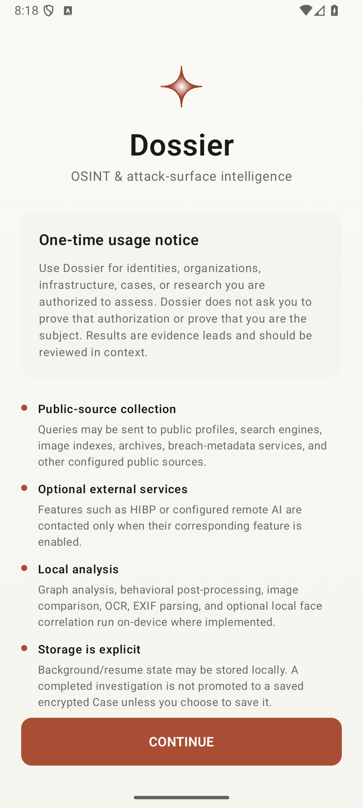
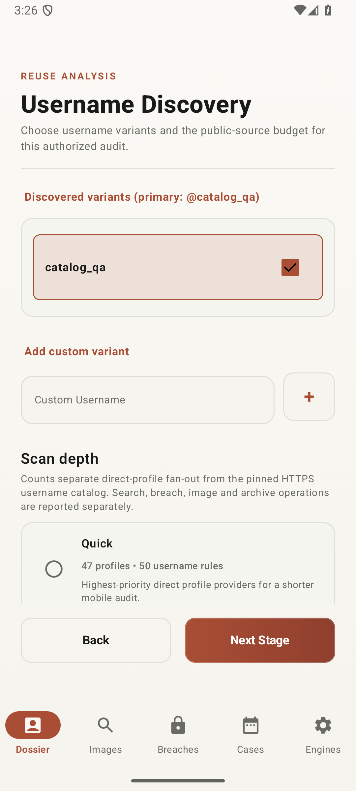
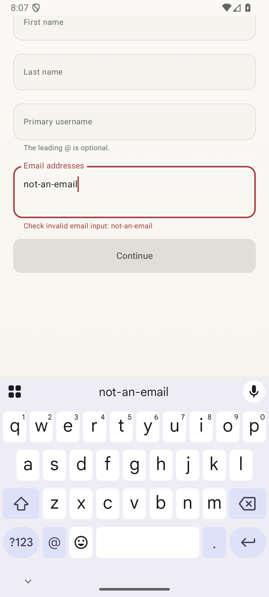
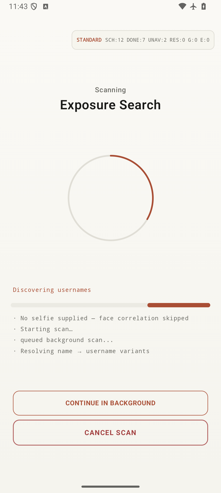
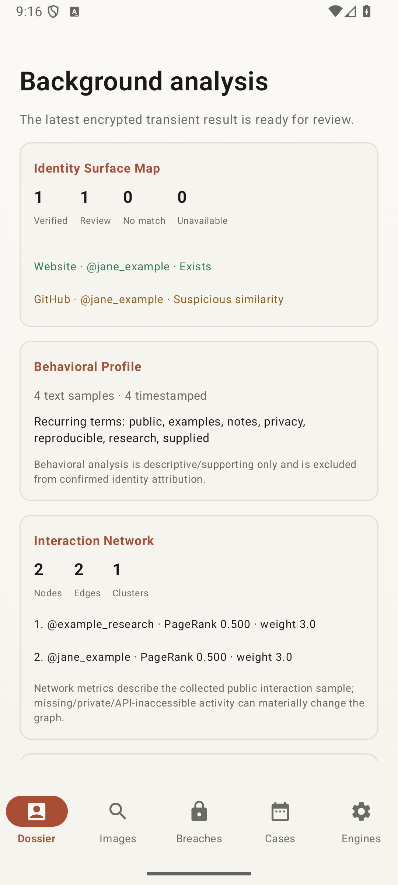
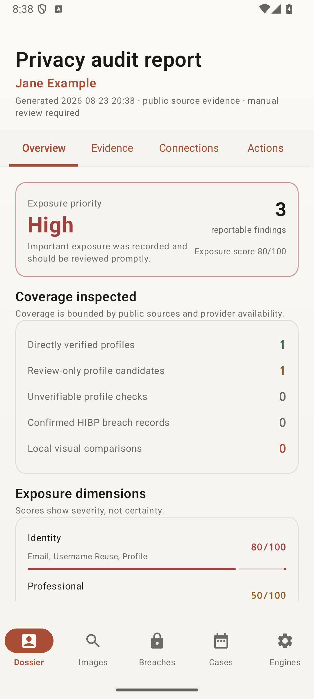
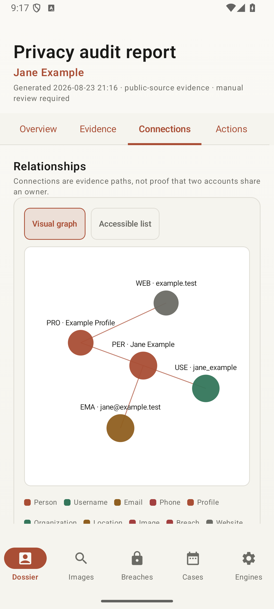
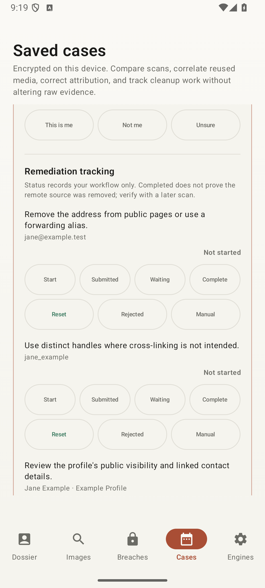

# Dossier

Dossier is a consent-first Android application for auditing a subject's public digital footprint when the subject owns the information, has consented, or the operator has another legitimate authorization.

It collects public evidence, preserves provenance, separates verification from review-only leads, correlates findings conservatively, and helps track remediation. Dossier does not treat search results, shared usernames, image/face similarity, AI output, or graph connections as proof of identity or account ownership.

## Current status

The current implementation branch is **83/100 under the strict production rubric**.

Validated implementation commit:

```text
ae7bfc8
```

`ae7bfc8` adds an optional encrypted deterministic exposure-score checkpoint that stores only bounded dimension scores and hashed finding references, bound to the exact request, immutable provider-plan fingerprint, owner, TTL and SHA-256 digest of all scoring inputs; malformed, oversized, mismatched, incomplete-stage, tampered or record-too-large payloads fail closed and rerun scoring. It also rejects late provider/pivot projections after a terminal scan while retaining exact-owner checkpoint observability. `82568cd` adds the attack-path checkpoint, bound to the graph/confidence inputs; `d16c740` makes graph provenance exact-only: evidence-derived links carry their own IDs, while legacy id-less edges infer provenance only when one exact evidence record exists and remain idless for ambiguous URL/value matches. `1012ba3` adds the relationship-confidence checkpoint, bound to the full graph/evidence/seed input; `985dd5e` preserves exact unique ledger evidence IDs from entity-resolution support and contradiction contributions on graph profile edges without synthesizing provenance. `84f07d8` adds the earlier graph-stage checkpoint, bound to every graph-builder input; `bc623f0` adds a no-network maintenance preview that proves the pinned WhatsMyName rows convert to the Kotlin runtime contract without inflating the 78 authored-provider count. `67742db` adds an optional case-level audit that marks canonical and graph evidence IDs dangling when they do not resolve to the persisted evidence ledger, while preserving fail-soft behavior for legacy cases with no ledger. `7fd49df` keeps separately verified source pages as distinct reverse-image candidates when they reuse one canonical avatar URL, while still coalescing exact image+source duplicates. The validated tree also includes bounded encrypted post-processing checkpoint reuse (`c404592`), fail-closed legacy WorkManager status retirement (`acc325a`), its authenticated-tamper regression test (`0cbc2ca`), the request-plan binding follow-up (`1764233`), encrypted breach summaries (`9bc1cd3`), focused accessibility/reduced-motion hardening (`a810d0c`), exact relationship provenance migration (`4ee7e14`), the evidence-keyed media correction tranche (`674fe2b`), the exact-owner Pausing recovery fix (`0bd65dd`), canonical graph-assertion export separation, exact profile-evidence correction controls, bounded encrypted case persistence, held-out calibration provenance propagation, exact published-result owner recovery, pinned source-catalog maintenance diagnostics, bounded live evidence corrections, source-scoped media change history, a read-only canonical relationship source, structured face-comparison provenance, bounded graph-reconciliation diagnostics, fail-closed face-similarity math, Activity-recreation recovery, explicit provenance for external/legacy OSINT imports, direct verified-profile media linkage, and bounded encrypted relationship save/restore migration.

That exact implementation passed the current final-tree build and deterministic validation gates:

```text
Provider registry audit             PASS — 78 definitions (70 profile templates + 8 services)
WhatsMyName catalog integrity       PASS — 716 records / 644 executable HTTPS rules
Provider contract fixtures          PASS — 468 deterministic six-state decisions / no network
Provider maintenance audit tests    PASS — 11 tests / no-network schema, conversion-parity + pinned source-catalog fixtures
Debug JVM unit tests                PASS — 807 tests / 134 result XML files / 0 failures, errors, or skips
uiTest JVM unit tests               PASS — 807 tests / 134 result XML files / 0 failures, errors, or skips
Android-test Kotlin compilation    PASS — `compileUiTestAndroidTestKotlin`
Debug APK assembly                  PASS — 115,614,184 bytes
Debug APK SHA-256                   EDDFBF9147E9F90BAAEE093571281B1A125BF5D6722D3C15AC45E17111A0C3D0
uiTest APK assembly                 PASS — 243,128,761 bytes
uiTest APK SHA-256                  8697F8C77F59B59222CCBB8FAF9AE22C233F0875BB411CCF277C24B138CBFD43
Android-test APK                    PASS — 1,027,576 bytes
Android-test APK SHA-256             9A76115D8EF7D9406B54DFE9F4399876A514CC362FEE3E8EC6D5676D9E37368D
Debug lint                          PASS — 0 errors / 69 warnings
uiTest lint                         PASS — 0 errors / 72 warnings
Connected uiTest suite              PASS — 53 tests / 0 failures on API 36 `medium_phone` emulator
```

The complete connected uiTest suite ran on the API 36 `medium_phone` emulator, including the provider-health panel, 8 WorkManager pause/resume tests, encrypted Activity-recreation recovery, live finding/profile/media correction semantics, exact evidence-key fail-closed behavior, focused breach/report/reverse-media accessibility semantics, bounded CaseStore save behavior, async saved-case persistence, graph/export redaction semantics, HUD status semantics and reverse-video picker semantics. A fresh ADB smoke check seeded the production encrypted result store through the uiTest-only fixture, then verified the encrypted result remained visible after an external `am force-stop`/relaunch and after an emulator reboot, with the production `MainActivity` resumed after both launches. The uiTest APK was built with a pre-existing uncommitted fixture-only edit that remains outside the implementation commits; its hash is therefore a current-worktree artifact. Physical Samsung/Pixel/lower-memory devices, broad TalkBack/switch/keyboard, battery/thermal behavior, and full-stage process recovery remain unvalidated. Post-processing, graph-stage, relationship-confidence, attack-path and exposure checkpoint reuse are code-tested for exact binding/digest/shape/TTL/completed-stage behavior (including graph record-size fallback) but were not independently process-kill validated on the emulator. Terminal projection rejection, graph dangling-reference checks, exact-only legacy provenance, exact resolver support/contradiction provenance, source-page-aware reverse-image deduplication and WhatsMyName conversion parity are JVM/no-network tested; no claim of broad visual acceptance is made.

This is not a production-readiness claim. Provider scale/live validation, calibrated identity and face benchmarks, complete coordinator/frontier ownership, broader automatic verified-account acquisition/correlation, and representative physical-device/accessibility/performance validation remain release gates.

See `TRUTH.md` for the authoritative score and blockers. `AGENTS.md` defines the target product contract.

## Visual walkthrough

These captures come from the API 36 Medium Phone emulator. Analysis, report, case and provider-progress states use deterministic **uiTest-only** fixtures; case data is written through the production encrypted stores and provider counters are emitted through the production coordinator callbacks. All identity values and URLs are synthetic and use reserved `.test` domains. The receiver exists only in the uiTest source set and is absent from the debug manifest. The updated scan-budget screen and bottom navigation were also inspected at 1.0x, 1.3x, 1.5x and 2.0x font scale. Static screenshots do not establish TalkBack, whole-product large-font, reduced-motion, adaptive-layout or physical-device acceptance.

| Consent and input validation | Scan configuration |
|---|---|
|  |  |
|  |  |

| Background analysis | Evidence-oriented report |
|---|---|
|  |  |

| Explainable connections | Remediation tracking |
|---|---|
|  |  |

## Discovery Fabric

- Typed declarative provider registry with **78 authored provider/service definitions**.
- Separately pinned WhatsMyName username-surface catalog with **716 source records and 644 executable HTTPS rules** after parser and policy filtering. These are not 644 additional registry definitions or live-validated providers.
- Catalog bytes and the bundled CC BY-SA 4.0 license are pinned to upstream commit `e62338e4fc88536a330733d355a9d33a3a1697c6` and checked by exact SHA-256 before release evidence is recorded.
- Developer, social, forum, gaming, creative, publishing, professional, media, commerce, education, code/package, personal-site, archive, breach and search categories.
- Quick, Standard, Deep and Exhaustive scan modes backed by real provider plans rather than fake totals. Username-rule budgets are 50 / 200 / 500 / 644 per normalized handle, with at most three explicit handles; direct-profile counts remain separate.
- Provider query capabilities, source-reliability classes, existence/extraction rules and request policies.
- Direct-profile candidates execute through the declarative provider runtime with live selector-driven extraction, bounded reads, timeout/retry/cooldown policy, provider request spacing, exact/approved-host redirect checks, HTTPS-downgrade rejection and a generic non-impersonating user agent.
- Real queued, started, completed and unavailable callbacks drive scheduled/completed/unavailable counters; planned registry breadth is not presented as completed work.
- Persisted aggregate provider outcomes can be assessed against the exact catalog (including explicit Unvalidated, Healthy, Degraded, Unavailable and Stale states); health buckets are maintenance diagnostics, not evidence confidence or live-validation claims.
- The username-discovery flow surfaces the persisted catalog-health report with a bounded nonhealthy preview and explicit wording that catalog membership, HTTP 200 or search hits are not live validation; internally inconsistent counters and future validation timestamps are shown as unavailable rather than healthy.
- A deterministic no-network contract harness exercises present, absent, soft-error, redirect, challenge and malformed observations for every catalog definition; fixture outcomes are not promoted to provider health or evidence.
- Registry validation for duplicates, case-insensitive ID drift, malformed templates/hosts, unsupported placeholders, metadata categories/capabilities/reliabilities, parser drift and inventory drift; `tools/provider_registry_audit.py --json` exposes machine-readable maintenance diagnostics without performing network requests.
- The same audit verifies pinned WhatsMyName data/license hashes, byte size, generated rule IDs and runtime-equivalent policy exclusions (716 source records / 644 executable rules / 72 excluded) without counting source rules as registry providers.
- The maintenance audit also previews all 644 executable rows against the Kotlin category/ID/template/status-marker/request-policy conversion contract and proves the generated `wmn-*` namespace is disjoint from the 78 authored definitions; this is conversion parity, not live-provider health.
- Deterministic response states for present, not-found, soft-404, authentication-required, challenged, rate-limited, timed-out, network-unavailable, redirect, unexpected and invalid responses.
- Multiple bounded public-search sources, direct source verification, retries, `Retry-After`, caches and circuit breakers.
- Configured-depth bounded pivots (default two, hard maximum four) with admission rules: weak name/location/occupation/face-only signals do not recursively expand by themselves, and only verified results seed the next depth.
- Evidence-backed relationship endpoints reuse one exact unique canonical graph entity when available; ambiguous or unmatched values keep a synthetic unresolved node rather than creating a fuzzy merge.
- Exact-URL Internet Archive recovery for some deleted/replaced pages.

The long-term contract calls for 1,000+ useful reviewed providers. `ProviderCatalogV2` currently contains 78 authored definitions (70 profile templates and 8 services); the separate pinned WhatsMyName catalog contains 716 records, of which 644 are executable HTTPS username rules. Neither count is presented as registry-wide live validation.

## Scan orchestration and history

- `ScanCoordinatorRuntime` wraps the mature vertical scan pipeline.
- Production scan launch and cancellation now enter through `ScanCoordinatorRuntime`; direct `ScanSession` launch/cancel bridges are internal and tested through a coordinator seam. The coordinator binds the selected scan mode and provider-plan summary before dispatching durable work.
- Encrypted request checkpoints retain allow-listed stage names plus bounded item/verified/omitted counts for completed major stages; incomplete stage outputs remain eligible for rerun.
- New encrypted requests retain a sanitized mode/provider-plan fingerprint/count and allow-listed stage-order summary. Successful public-search and public-image retry payloads are now stored in request/plan/stage-bound encrypted envelopes with bounded size, TTL, tamper checks and scoped tombstones; response text and identifiers remain excluded, and in-flight/frontier payloads for the remaining stages are still not persisted. Background result envelopes additionally validate bounded nested case/graph/media/analysis collection shapes on save and authenticated load.
- Remediation cards expose reviewed provider-specific resources, manual-action fallback or explicit unavailable state; opening a settings page never asserts deletion and later scans remain required.
- Saved-case comparison exposes source-scoped historical/provider changes and remediation rechecks with exact evidence IDs and only newer successful scan IDs; missing or unavailable observations are not reported as deletion.
- Scanner/plugin relationship assertions with the same normalized endpoints and relation are merged deterministically while unioning their evidence IDs and retaining a nonblank description, so one producer cannot erase another producer's provenance.
- Canonical relationship assertions are now stored in versioned encrypted cases alongside evidence records, restored into the runtime cache, migrated from legacy evidence IDs, and bounded to 10,000 relationships with at most 256 evidence IDs per relationship.
- Scanner-produced profile and finding relationships now carry the exact stable `Evidence.id` values created for those observations; relationship provenance is not reconstructed from endpoint text.
- Graph exports keep the `EntityGraph` projection separate from the read-only canonical scanner/plugin assertion ledger; case exports include a distinct `*.canonical-assertions.csv` sidecar, and ShareSafe redaction removes assertion endpoints, evidence text and identifiers before files are written.
- Reddit public-activity and WhatsMyName username-surface relationships also carry the exact stable IDs of the emitted evidence records.
- Scan HUD status pills expose positive, warning, critical and informational state through Compose `stateDescription` semantics, while color remains supplemental.
- Structured scan IDs, requests, run states and events.
- Live UI state derives from real scan-stage/profile/face/breach/graph/analysis observations.
- Direct-profile execution emits provider queued/started/completed/unavailable events with one stable scan ID; retries do not inflate unique started counts and stale callbacks are ignored.
- Identity seeds, scan mode, deep-scan choice and per-scan face policy are stored in an Android Keystore AES-GCM resume record; new WorkManager requests receive only its opaque UUID.
- Stable results from the initial direct-profile pass are checkpointed per request, plan and canonical candidate in Android Keystore AES-GCM storage. A restarted worker reuses only exact, unexpired stable outcomes; transient network, timeout, challenge and parser failures are fetched again.
- New encrypted scan requests commit a deterministic SHA-256 fingerprint of the selected declarative provider plan plus a bounded ordered provider-ID summary; older request records remain explicitly resumable without being assigned a retroactive plan.
- The configured-depth pivot path now uses a request-scoped encrypted frontier with queued, visited and completed state, conservative admission, global/per-signal budgets, bounded rejection diagnostics and durable clear tombstones. A cancelled or thrown pivot attempt remains pending for a later exact-scope worker retry.
- Background WorkManager scans now expose exact-owner `Pausing`/`Paused` lifecycle states, retain encrypted checkpoints through terminal cancellation, resume with a fresh work UUID bound to the same request/generation, and surface pause/resume controls in Background analysis.
- The exact owner also writes an encrypted, allow-listed semantic stage ledger (profile discovery, face, breach, graph, scoring, exposure, AI, post-processing and completion) plus bounded item/verified/omitted counts for completed major stages; sanitized checkpoint events update the coordinator snapshot without persisting URLs, identifiers or response text.
- Completed graph construction may additionally retain a bounded encrypted graph payload. Reuse requires the completed graph-stage marker plus exact request/plan/owner/TTL and a digest over every graph-builder input; malformed, stale, tampered, oversized or record-too-large payloads are discarded and the graph is rebuilt, with semantic stage counts retained as the fallback.
- Completed relationship-confidence scoring may additionally retain a bounded encrypted score/reason map. Reuse requires the completed scoring marker plus exact request/plan/owner/TTL and a digest over the full graph/evidence/username-seed input; malformed, unsafe, stale, tampered, oversized or record-too-large payloads are discarded and scoring reruns, with semantic stage counts retained as the fallback.
- Completed attack-path tracing may additionally retain a bounded encrypted path/step payload. Reuse requires the completed tracing marker plus exact request/plan/owner/TTL and a digest over the graph/confidence input; malformed, unsafe, stale, tampered, oversized or record-too-large payloads are discarded and path tracing reruns, with semantic stage counts retained as the fallback.
- Completed exposure scoring may additionally retain a bounded encrypted dimension/top-finding projection. Raw finding values, URLs, snippets and remediation text are excluded; only current in-memory findings can rebuild the top-finding projection after the exact input digest matches. Malformed, unsafe, stale, tampered, oversized, incomplete-stage or record-too-large payloads are discarded and exposure scoring reruns, with semantic stage counts retained as the fallback.
- Terminal coordinator snapshots reject late provider and pivot projections for the owned scan ID; owner-validated checkpoint events remain observable without allowing stale work to mutate terminal counts.
- Background WorkManager progress and failures are reduced to fixed stage/error codes rather than persisting arbitrary exception or identity text.
- Legacy WorkManager progress/output rows with unexpected keys or value types are fail-closed and logically retired from the UI projection; this does not claim forensic SQLite/WAL erasure.
- Background enqueue now publishes a generation-bound lifecycle before replacing the old exact WorkManager UUID, promotes only that prepared encrypted request, and reenqueues the same UUID after an authoritative missing-row crash boundary.
- The worker claims the exact owner/request/generation, publishes the encrypted result before durable success, and treats an exact matching result as idempotent success if WorkManager retries after the success-commit boundary.
- If a retry observes the exact owner with the result already durably published, lifecycle reconciliation promotes that request to success before rerunning stages; owner and result identity must match and paused/mismatched records remain fail-closed.
- Process startup reconciles only `getWorkInfoById` for the persisted owner, retries unavailable lookups without mutation, and never adopts a unique-work-list result by ordering.
- Cancellation persists intent first and reports cancellation only after the exact WorkInfo row is terminal; completion/failure races return through result-aware reconciliation.
- Result replacement uses file and parent-directory sync plus atomic replacement, while cleanup is exact owner/request/generation scoped.
- Terminal scan lifecycle stores actual start/end time, mode, plan size, result counts and cancellation state.
- A SHA-256 fingerprint of normalized seed values binds a completed scan to the matching initial explicit encrypted case save without maintaining a duplicate plaintext identity cache.
- Later case edits cannot silently attach a newer scan to an older case.

Recovery now covers stable initial direct-profile outcomes, the configured-depth pivot frontier, an exact-owner background pause/resume lifecycle, an encrypted mode/provider-plan/stage-order commitment, semantic stage-boundary metadata, bounded completed-stage output counts, encrypted public-search/public-image retry payloads, encrypted breach summaries, encrypted deterministic post-processing, graph-stage, relationship-confidence, attack-path and exposure outputs. The payload envelopes are request/plan/stage-bound, bounded, TTL-limited, tamper-checked and cleared with request-scoped tombstones; verified profile outcomes cannot enter these public-discovery caches. A coordinator-owned parser/frontier plan, universal in-flight payload persistence, sole coordinator ownership and full-stage resume semantics remain incomplete: a recreated worker still reruns earlier stages before it can reuse a later deterministic output. Pivot diagnostics are persisted and terminal provider/pivot projection updates are rejected after completion, while some mature custom resolvers still need migration to the declarative execution path. An ADB-driven force-stop/relaunch and emulator-reboot smoke check restored the encrypted background result through the production UI using a uiTest-only synthetic fixture; it does not establish full-stage worker recovery or physical-device acceptance.

## Evidence, graph and entity resolution

- Identity seeds: names, usernames, aliases, emails, phone numbers, locations, organizations and explicit profile URLs.
- Attribution-aware PII extraction.
- Evidence records can retain provider ID, URL, retrieval/observation timestamps, verification state, reliability, SHA-256, parser version and historical/current state.
- Numeric confidence is separate from verification state.
- Graph v2 provides semantic node kinds, typed relationships, evidence IDs, contradiction IDs, history fields and verification/conflict state while retaining saved-case compatibility.
- Case-level graph reconciliation can optionally audit canonical relationship and graph-edge evidence IDs against the persisted evidence ledger, marking unresolved IDs as dangling instead of treating matching endpoint/relation projections as sufficient; legacy cases with no evidence ledger remain explicitly fail-soft.
- Legacy relationship provenance is migrated only through exact existing endpoint/source evidence matches; graph queries expose both positive and contradicting evidence links.
- Scanner relationship edges preserve the exact profile/finding evidence IDs that produced them, so graph drill-down can inspect the originating observation without guessing from a URL or endpoint label.
- Multi-signal account resolution is integrated into the production graph.
- A deterministic benchmark harness reports confusion-matrix counts, precision, recall, F1, false-positive rate, false-negative rate and unverifiable-case accuracy over digest-bound corpora.
- Calibration artifacts are schema/version/digest/policy checked; synthetic fixtures cannot activate production policy, and consented artifacts must meet minimum positive/negative sample counts before exact-corpus activation.
- Production activation also requires explicit `HELD_OUT` split metadata, a distinct training-corpus digest, an authorization-record digest and caller-supplied matches for all provenance values; regression/synthetic artifacts fail closed and cannot masquerade as representative calibration.
- **A shared username alone is not sufficient to confirm identity.**
- Contradictory evidence is preserved.

The shipped synthetic corpus is a regression harness, not representative identity evidence. Entity-resolution weights remain engineering values until a consented representative corpus produces and publishes measured precision, recall, false-positive/false-negative behavior and calibration.

## Reverse-image and visual checks

The selected reference image stays on-device. Dossier may search text/identity clues, download public candidate images, and compare those public images locally.

Implemented whole-image duplicate/repost analysis:

- SHA-256 exact matching;
- pHash, dHash and aHash;
- colour-histogram comparison;
- full-image, centre-crop and square-crop variants;
- exact-copy, near-identical, resized/recompressed and modest-crop detection;
- stable candidate IDs;
- per-candidate provenance containing source, source page, acquisition query, compared URL, retrieval timestamp, content/perceptual hashes, dimensions, comparison score and outcome;
- bounded encrypted case persistence for image results, candidate provenance and duplicate clusters;
- case-load normalization that deduplicates IDs, removes orphan clusters and strips dangling or mislinked references;
- graph enrichment that connects persisted image candidates/clusters to matching public account pages without making identity claims;
- truthful candidate states for unavailable download, decode failure, compared/no-match and match;
- deterministic exact-content and perceptual-near-duplicate clusters with stable IDs;
- Reverse Media UI for candidate-state totals, cluster summaries, hash/dimension details and source drill-down.
- bounded saved-case whole-image cluster history groups repeated fingerprints across saved cases while retaining case/cluster/source/retrieval provenance;
- saved-case media comparison reports bounded source-page/image-URL keyed `ADDED`, `CHANGED`, `UNCHANGED`, `NOT_OBSERVED_IN_LATEST_CASE` and `UNAVAILABLE` observations from recorded hashes, dimensions, retrieval state and timestamps; it never uses candidate IDs or visual scores as identity keys;
- explicit `ImageAccountLinkage` records can link a candidate to an exact account page only from a verified-profile association or a user review, with bounded evidence IDs and timestamps; visual scores and clusters never create this identity edge;
- accessible review wording explicitly states that repeated whole-image content does not establish shared account or person identity.

Whole-image clusters mean **duplicate/reposted image content**. They do not mean two different photos depict the same person.

Optional local cross-photo face support uses pinned YuNet/SFace models with exact size/SHA-256 verification, deterministic preprocessing, five-landmark alignment, ambiguity/quality rejection and cosine scoring. Each comparison now retains bounded structured backend/model-hash/pipeline, calibration-state and selfie/profile-quality provenance, including explicit reference-policy, measured, imported, fallback and not-run states. Face similarity remains supporting evidence; release thresholds are not advertised as measured identity probabilities until a representative benchmark exists.

Directly scanned, verified profile avatars now produce bounded `VerifiedProfile` linkages with `profile:<url>` evidence; reverse-image candidate collection retains separately verified source pages even when they reuse one CDN avatar URL, while exact image+source pairs coalesce deterministically. Broader verified-account acquisition/correlation and independent visual acceptance remain incomplete. Explicit verified-profile and user-reviewed linkages are evidence-carrying associations rather than automatic identity conclusions. Whole-image similarity and face similarity are supporting evidence, not identity proof.

## Historical evidence

- Bounded exact-URL Wayback lookup and snapshot verification.
- Historical evidence is labeled separately from current evidence.
- Historical confidence is capped.
- Timeline construction uses only real evidence timestamps or provider breach dates.
- Untimestamped observations are omitted rather than assigned fabricated dates.
- Directly re-fetched Wayback HTML is parsed with bounded fail-soft rules for explicit historical display name, bio, username, avatar URL, external links, organization and location attributes. These retain archive reliability, capture timestamps, historical state and semantic attribute labels in the timeline and graph.

Equivalent extraction across every archive/provider source and universal archive timestamp propagation remain incomplete; saved-case comparison now provides bounded source-scoped historical/provider change diffing with explicit unavailable and not-observed states.

## Breach checks

- Pwned Passwords five-character SHA-1 range lookup; the full password is not transmitted.
- HIBP account range lookup when user-supplied supported access is available.
- No silent fallback to sending a complete email address when the privacy-preserving account-range flow is unavailable.
- Authoritative breach coverage remains distinct from general public-web exposure.
- Not-configured, rejected, rate-limited and unavailable states are explicit.
- Breach dates, provider/retrieval metadata and data classes are retained.
- Dossier does not bundle or distribute stolen credential databases or leaked passwords.

## Evidence-grounded AI

- Deterministic local analysis is always available as fallback.
- Optional local/device and user-configured remote engines.
- Retrieved content is treated as untrusted evidence, not instructions.
- Generated factual claims must use structured output and cite existing evidence IDs.
- Claims referring to nonexistent evidence IDs or making uncited factual assertions are rejected.
- Contradiction can downgrade a generated high-confidence claim.
- Malformed/unsupported generated output falls back to deterministic analysis instead of being displayed raw.
- Remote processing remains opt-in and disclosed.
- Remote graph entities and relationships carry bounded pseudonymized references to supporting and contradicting evidence from the same evidence window; raw local evidence IDs do not cross the remote boundary.
- Evaluation fixtures are integrity-checked before use: IDs, graph endpoints, edge evidence references, remediation links and bounded corpus sizes must be unique, well-formed and internally resolvable. Remediation outcome language additionally requires an effective reviewed resource, a completed status, a later successful durable verification scan with valid chronological timestamps, and cited support evidence.

A production-sized/adversarial AI evaluation corpus remains incomplete; corrected/remediation-native validation is bounded and wired on every model path.

## Encrypted cases, corrections and remediation

- Active scan state is temporary by default.
- Explicit saves use Android Keystore-backed AES-256-GCM.
- Versioned case schema, atomic writes and integrity verification.
- Legacy plaintext AI keys migrate into encrypted storage; unusable encrypted keys fail closed without a plaintext fallback for new reads.
- Case schema v3 supports authorized scope, scan history, user corrections, remediation records and export records.
- Saved-case comparison uses explicit older/newer roles.
- Evidence decisions: **Mine / Not mine / Unsure / Ignore**.
- Account decisions: **This is me / Not me / Unsure**.
- Corrections affect effective analysis/graph membership without deleting raw encrypted evidence.
- Live report profile cards expose the same bounded Confirm / Reject / Unsure / Ignore correction decisions when exactly one persisted profile evidence record can be resolved; ambiguous or missing IDs fail closed.
- Reverse-image visual provenance cards now expose the same draft decisions for exactly one directly verified-profile linkage whose source page and persisted Profile evidence ID match; generic candidates, user-reviewed linkages without a unique persisted record, and ambiguous evidence remain explicitly unavailable.
- Encrypted CaseStore writes reject plaintext payloads above 8 MiB or envelopes above 12 MiB, bound legacy/encrypted reads, and preserve the last-good case when a save is rejected before atomic replacement.
- Remediation states: Not started, In progress, Submitted, Awaiting response, Completed, Rejected and Needs manual action.
- Reviewed provider-settings resources are catalog-validated (HTTPS, provider ownership, no userinfo/query/fragment) with manual-action or unavailable fallback when no reviewed resource exists; the catalog currently covers eight providers and is not deletion proof.
- Differential comparison classifies added, removed, changed and unchanged findings; saved-case media review also reports bounded source-page/image-URL keyed added, changed, unchanged, not-observed and unavailable observations without using visual identity or candidate IDs as keys.
- Recheck UI distinguishes **Still observed**, **Not observed in latest scan**, **Workflow status changed** and **Not rechecked**.
- Recheck rows retain the exact observed evidence ID and only a newer successful verification scan ID; failed/cancelled scans remain **Not rechecked**.
- `Not observed in latest scan` explicitly does **not** mean verified deletion from every live page, search index, cache or archive.
- Live report Finding cards expose bounded Confirm / Reject / Unsure / Ignore draft decisions with explicit selected-state semantics; raw evidence remains retained and the decision is local until the user explicitly saves the encrypted case.

## Reports and share-safe export

- Paginated PDF plus machine-readable JSON evidence package.
- Graph exports include GraphML, node/edge CSV and JSON projection files plus a separate canonical scanner/plugin assertion CSV sidecar when a saved case contains the assertion ledger; the projection is not treated as the assertion source of truth.
- Per-section SHA-256 hashes and canonical manifest hash.
- Explicit `ShareSafe` mode from saved Cases.
- Redaction happens **before export files are written**.
- Share-safe mode removes/generalizes direct subject values, source URLs, snippets, profile details, graph labels/details, breach identifiers, visual source URLs and generated analysis that may reproduce identifying evidence.
- JSON records redaction mode.
- UI warns that redaction reduces disclosure but cannot guarantee anonymity; generated files should be reviewed before sharing.

## Privacy and network behavior

Dossier has no required project-operated backend and does not include analytics telemetry. It is not fully offline.

Network-dependent operations can include public profile/source checks, search/image-index acquisition, archive retrieval, public candidate-image/model downloads, HIBP range queries and optional remote AI.

Local operations include reference-image processing, exact/perceptual image comparison, YuNet/SFace inference, PII parsing, graph/risk analysis, encrypted case and scan-checkpoint state, report generation and share-safe redaction.

The reverse-image matcher and bounded WebView renderer identify themselves generically as Dossier rather than impersonating a consumer browser/device. WebView scraping is cookie-free, blocks non-HTTP(S), cross-host and HTTPS-downgrade top-level navigation, and restores the app's prior cookie setting without clearing the separate evidence browser's global storage. Challenge pages and source restrictions are reported rather than bypassed.

## Build and validation

Requirements:

- JDK 21
- Android SDK 35
- Android Studio or Gradle wrapper
- Android 8.0+

Core checks:

```sh
python3 tools/provider_registry_audit.py
pwsh -File tools/verify_whatsmyname_catalog.ps1
./gradlew :app:testDebugUnitTest
./gradlew :app:assembleDebug
./gradlew :app:connectedUiTestAndroidTest
```

CI separately validates the pinned Python/OpenCV face-calibration environment.

A release build requires private signing properties:

```sh
./gradlew :app:assembleRelease
```

Do not commit `local.properties`, keystores, credentials, API keys, personal test identities, developer-specific paths or real-user screenshots.

## Known limitations

- `ProviderCatalogV2` has 78 authored definitions, while the separate pinned WhatsMyName catalog has 716 records and 644 executable HTTPS username rules; this remains below the 1,000+ useful reviewed-provider target and does not establish live health.
- Private, authenticated, blocked, never-indexed and never-archived content cannot be discovered reliably.
- Providers can change markup, challenge requests, rate-limit or omit content.
- Some custom resolver operations still bypass unified provider lifecycle events; the persisted coordinator plan is currently a metadata commitment rather than a general parser/frontier payload. Public-search/public-image retry payloads are persisted with bounded encrypted envelopes, but universal in-flight stage/frontier payloads and full coordinator ownership remain incomplete. Background pause/resume is exact-owner bounded rather than a universal coordinator pause contract.
- Pre-upgrade WorkManager rows may retain legacy raw scan input until WorkManager pruning; new rows are opaque, but no forensic SQLite/WAL erasure claim is made.
- Generation-bound startup reconciliation and cancellation are implemented; external force-stop/relaunch and emulator-reboot restoration is recorded for the encrypted result path, while full-stage worker recovery remains open.
- Replacement-generation cleanup is best effort after WorkManager enqueue acknowledgement. A crash or cleanup failure in that narrow hand-off can retain an encrypted prior-request profile scope until explicit purge or later maintenance; a durable retirement ledger remains open.
- UI latest-result reads, purge, saved-case listing/deletion, case analysis, corrections, remediation updates and case-save actions now use IO-dispatched seams; lower-level synchronous helpers remain for controlled lifecycle paths. Background result envelopes enforce bounded file, metadata, IV, ciphertext and plaintext sizes before allocation/decryption and reject oversized nested case/graph/media/analysis collection shapes before save or after authenticated load. Large-case ANR/storage-corruption testing remains open.
- Entity resolution has deterministic metrics and a fail-closed calibration-artifact path, but still needs a consented representative corpus and published measured calibration before weights can be treated as empirically fitted.
- Broader automatic verified-account acquisition/correlation and richer cross-scan image change workflows remain open; directly scanned verified-profile avatars, source-page-aware candidate retention, explicit user-reviewed account linkages, bounded candidate/cluster provenance persistence and saved-case fingerprint history review are implemented.
- Provider-specific remediation resources currently use a small reviewed allowlist and truthful manual/unavailable fallback states; opening a provider settings page is not deletion proof and broader reviewed coverage remains open.
- Cross-photo face correlation still requires measured ROC/FAR/FRR and representative physical-device validation.
- Historical extraction is currently strongest for directly re-fetched Wayback HTML; archive/provider-wide structured extraction and universal timestamp propagation remain incomplete even though bounded source-scoped change diffing is available.
- HIBP email coverage depends on user-supplied supported access and provider availability.
- Share-safe redaction reduces disclosure but cannot guarantee anonymity.
- Visual QA currently covers one API 36 emulator viewport with synthetic data. HUD severity and reverse-video picker semantics have connected instrumentation assertions, and the changed scan-budget and bottom-navigation states were checked at 1.0x, 1.3x, 1.5x and 2.0x font scale, but this does not establish whole-product TalkBack/accessibility, landscape/tablet or physical-device acceptance.
- Emulator CI cannot replace Samsung/Pixel/lower-memory, accessibility, font-scale, process-death, thermal, battery and large-case validation.

## Documentation policy

The repository intentionally keeps only three Markdown documents:

- `README.md` — public product/build documentation.
- `AGENTS.md` — authoritative product/engineering contract.
- `TRUTH.md` — authoritative current status, validation record and remaining work.

Do not add separate status, roadmap, audit, handoff, findings or completion Markdown files. Update `TRUTH.md` instead.

## License

Apache License 2.0. See `LICENSE`.
